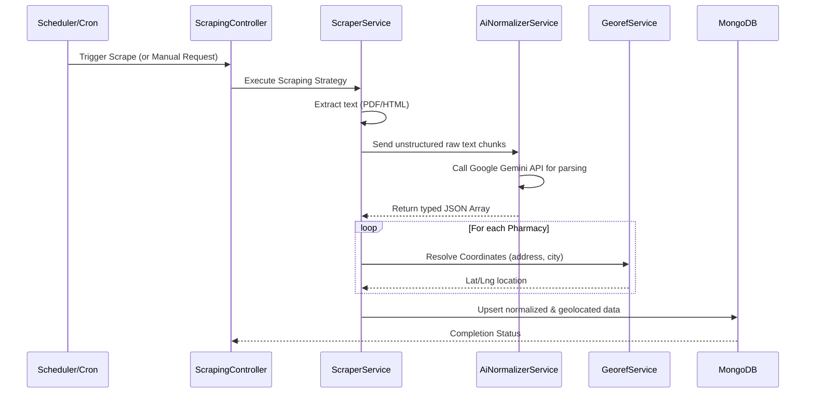
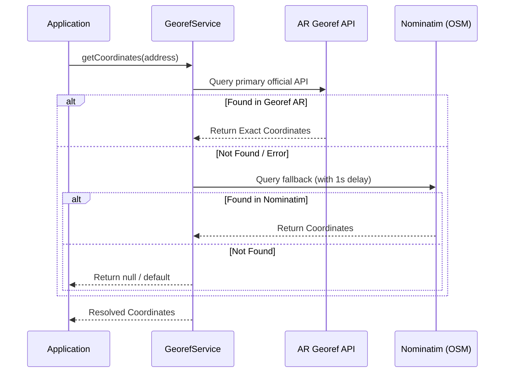
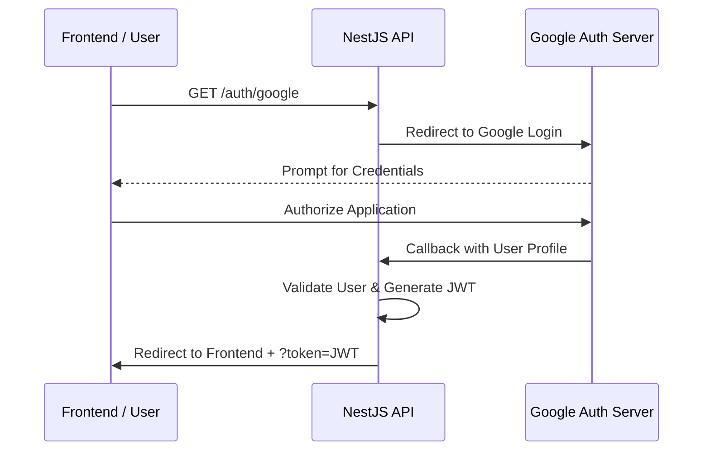

# FarmaYa AR - Georeferenced Pharmacy Tracker

FarmaYa AR is a modern, high-performance NestJS backend system designed to track, normalize, and georeference on-duty pharmacies in Argentina (initially focusing on the Jujuy province). 

The platform leverages AI-driven OCR text normalization (Google Gemini) and multi-source geocoding to provide accurate, real-time information about pharmacy availability, locations, and schedules.

## 🚀 Features

*   **AI-Driven Normalization:** Uses the Google Gemini API to parse unstructured text (often visual grids or collapsed OCR text from PDF documents) into strictly typed JSON data.
*   **Geocoding Fallback Strategy:** Primary geocoding via the official Argentina Georef API, with Nominatim (OpenStreetMap) as a robust fallback.
*   **CQRS Architecture:** Strict separation of Commands and Queries using `@nestjs/cqrs` for highly maintainable and scalable domain logic.
*   **Automated Scraping:** Scheduled and triggered scrapers using `cheerio` and `pdf-parse` to keep pharmacy schedules up to date.
*   **Secure Authentication:** Google OAuth2 flow integrated with secure JWT session management.
*   **Agentic Development Workflow:** Built entirely with a test-driven, multi-agent AI architecture ensuring high code quality and strict security layers.

## 🛠️ Technology Stack

*   **Framework:** NestJS (v11)
*   **Language:** TypeScript
*   **Database:** MongoDB (Mongoose)
*   **AI Integration:** Google Gemini API (`@google/genai`)
*   **Validation:** Zod (v4), `class-validator`
*   **Scraping:** Cheerio, `pdf-parse`
*   **Auth:** Passport (Google OAuth2, JWT)
*   **Architecture:** Clean Architecture + CQRS

## ⚙️ Architecture

The project follows a modular structure focused on the separation of concerns:

*   **Presentation Layer (`/src/presentation`):** REST controllers for pharmacies, scraping triggers, auth, and community reports.
*   **Application Layer (`/src/application`):** CQRS Command/Query handlers, AI normalization workflows, and geocoding services.
*   **Infrastructure Layer (`/src/infrastructure`):** Database schemas, repository implementations, external scrapers (e.g., Colfarjuy), and security services.
*   **Domain Layer (`/src/domain`):** Core entities and abstract repository interfaces.

## 📊 System Workflows

### 1. Scraping & AI Normalization Pipeline


### 2. Geocoding Fallback Strategy


### 3. Authentication Flow (OAuth2)


## 📋 Prerequisites

*   Node.js (v20+)
*   Docker & Docker Compose (for the local MongoDB instance)
*   A valid [Google Gemini API Key](https://aistudio.google.com/app/apikey)
*   Google OAuth2 Client Credentials

## 🔧 Installation & Setup

1. **Install Dependencies:**
   ```bash
   npm install
   ```

2. **Environment Variables:**
   Create a `.env` file in the root of the project with the following structure:
   ```env
   # Database
   MONGODB_URI=mongodb://localhost:27017/farmaya
   
   # External APIs
   GEMINI_API_KEY=your_gemini_api_key
   
   # Authentication
   JWT_SECRET=your_secure_secret
   GOOGLE_CLIENT_ID=your_google_client_id
   GOOGLE_CLIENT_SECRET=your_google_client_secret
   GOOGLE_CALLBACK_URL=http://localhost:5001/auth/google/callback
   
   # Frontend URL (for OAuth redirection)
   FRONTEND_URL=http://localhost:5173
   
   # Server Port
   PORT=5001
   ```

3. **Start the Infrastructure:**
   Spin up the required MongoDB container via Docker:
   ```bash
   npm run infra:up
   ```

4. **Run the Development Server:**
   ```bash
   npm run start:dev
   ```

## 🧪 Testing

Testing is a mandatory phase of our Agentic Workflow. Features must include Unit and E2E tests.

*   **Run Unit Tests:** `npm run test`
*   **Run E2E Tests:** `npm run test:e2e`
*   **Check Test Coverage:** `npm run test:cov`

## 🔒 Security & Authentication

Endpoints modifying data or triggering scrapers are protected via `JwtAuthGuard`. The login flow is initiated at `/auth/google`. Upon success, the backend issues a JWT and redirects the user to `${FRONTEND_URL}/auth?token=<jwt>`.

Global rate limiting (100 requests/minute) is enforced to protect the API, with stricter limits placed on community reporting features.

## 🤖 Agentic Workflow

This project enforces a multi-agent architectural approach as defined in `AGENTS.md`. Every new feature or refactor must pass through the following strict phases:

1. **Phase 1:** Design & Core Logic (Interfaces, DTOs, Modules)
2. **Phase 2:** Persistence (Schemas, Repositories, Migrations)
3. **Phase 3:** Security Pass (Guards, Validation)
4. **Phase 4:** Unit Testing (Isolated `.spec.ts` files)
5. **Phase 5:** E2E Integration (Full HTTP simulations)
6. **Phase 6:** Final Code Review

*No feature is considered complete without passing all phases.*
